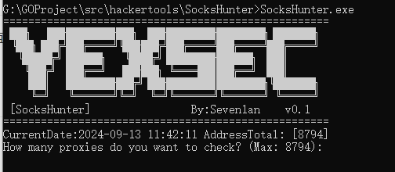
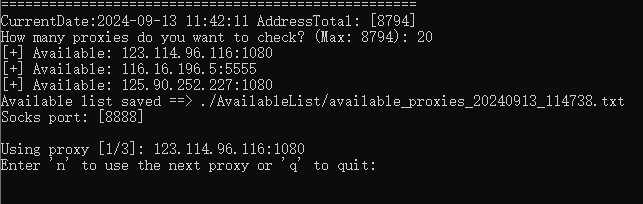
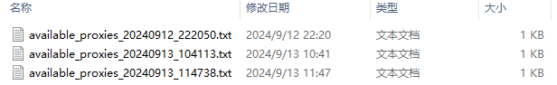
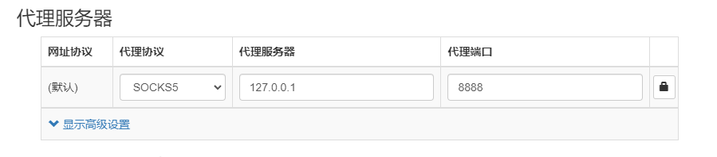
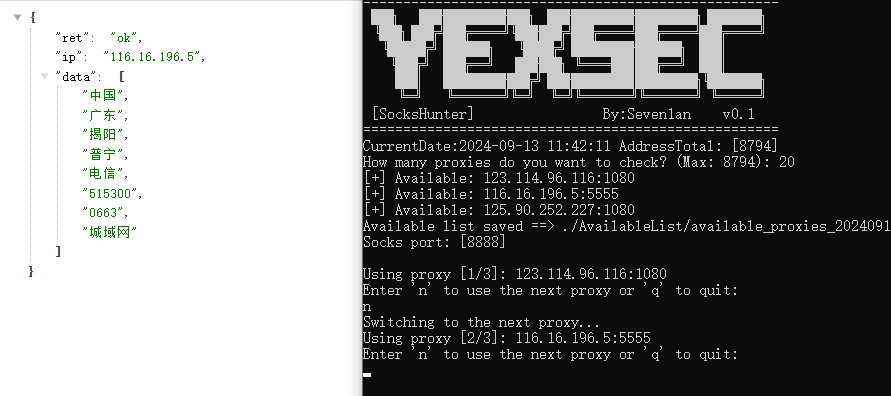

# SocksHunter

一款高效的 Socks5 代理采集与使用工具

本项目旨在为渗透测试过程中，因 **IP 封禁** 导致无法访问目标的情况提供解决方案，通过快速采集和切换可用的 **Socks5 代理**，帮助测试人员突破访问限制

## 声明

**本项目所有内容仅作为安全研究和授权测试使用, 相关人员对因误用和滥用该项目造成的一切损害概不负责**

## 原理

通过资产测绘平台、互联网公开接口等，获取大量代理数据，利用并发技术快速检测代理的可用性，并将可用代理自动写入 v2ray 配置文件中

截止到2024年9月13日数据源  1个

- Fofa

后续考虑加入Hunter，Shadon等其他平台

## 使用方法

config.ini文件中写入key

 

终端运行

 

这里会显示出截止到当前运行时间，一共采集到了多少地址 	

输入验证数量 	**注：采集到和能用是两码事，所以需要输入数量验证是否可用**

 

当然，验证的数量越多可用的也就越多，并且每一次验证地址都是变化的

检测存活结果会先放到AvailableList目录下

 

然后在本地开启8888端口

使用代理工具连接即可

可以输入n键切换到下一个地址使用，或输入q键退出

## 效果

 

 

